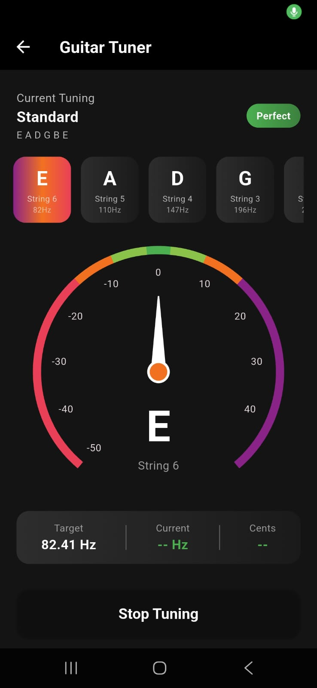
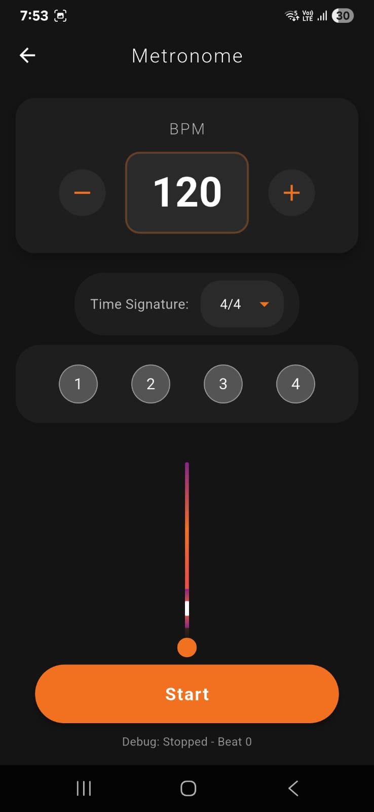
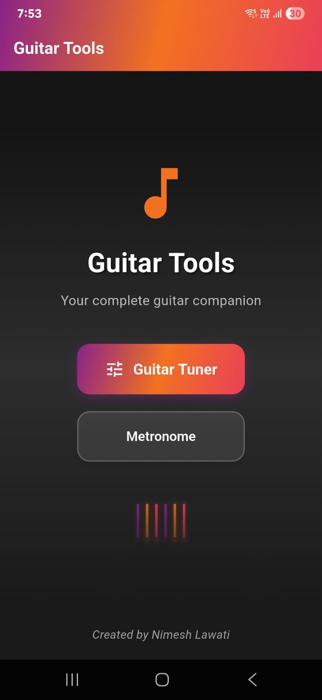

# 🎸 Guitar Tuner & Metronome

A professional-grade Flutter application combining a precision guitar tuner and an advanced metronome with real-time audio processing.

[](https://flutter.dev)
[](https://dart.dev)
[](https://opensource.org/licenses/MIT)

##  Features

###  Guitar Tuner
- **Real-time pitch detection** using FFT algorithms
- **Multiple tuning modes** (Standard, Drop D, Open G, etc.)
- **Visual feedback** with precision gauge (Syncfusion Flutter Gauges)
- **Auto-string detection** - automatically identifies which string you're playing
- **Cent-based tuning accuracy** (±50 cents range with color-coded feedback)
- **Microphone permission handling** with proper error states

### Advanced Metronome
- **Precision audio scheduling** with lookahead technique (studio-quality timing)
- **BPM range**: 40-240 BPM with 5 BPM increments
- **Multiple time signatures**: 2/4, 3/4, 4/4, 5/4, 6/4
- **Audio player pooling** for zero-latency tick sounds
- **Visual pendulum animation** synchronized with beats
- **Low-latency audio playback** using AudioPlayers library

## Technical Architecture

### Audio Processing
- **Pitch Detection**: Utilizes `pitch_detector_dart` with FFT algorithms for accurate frequency analysis
- **Audio Capture**: `flutter_audio_capture` for real-time microphone input
- **Audio Playback**: `audioplayers` with player pooling for metronome ticks
- **Scheduling**: Custom lookahead scheduler for precise beat timing (±10ms accuracy)

### State Management
- **Provider pattern** using Flutter's built-in `ChangeNotifier`
- **Reactive UI updates** with `AnimatedBuilder`
- **Separation of concerns** between controllers and views
## 📱 Screenshots

### Guitar Tuner


### Advanced Metronome


### Home Screen


### Key Technical Highlights
```dart
// Lookahead scheduling for precise metronome timing
void _scheduler() {
  final now = _clock.elapsed;
  while (_nextBeatTime <= now + _scheduleAheadTime) {
    _playScheduledBeat();
    _nextBeatTime += _beatInterval;
  }
}
